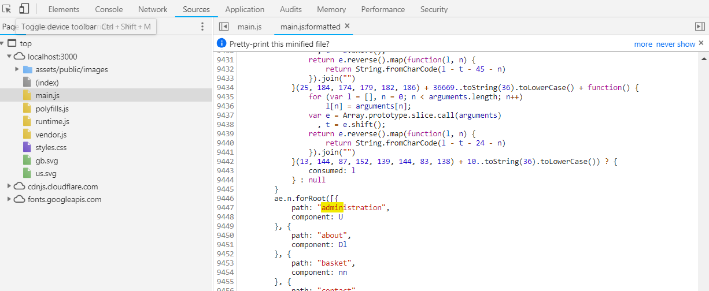
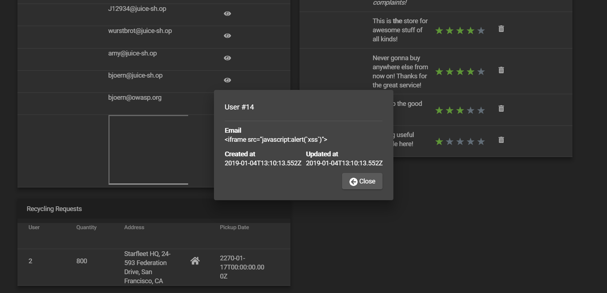
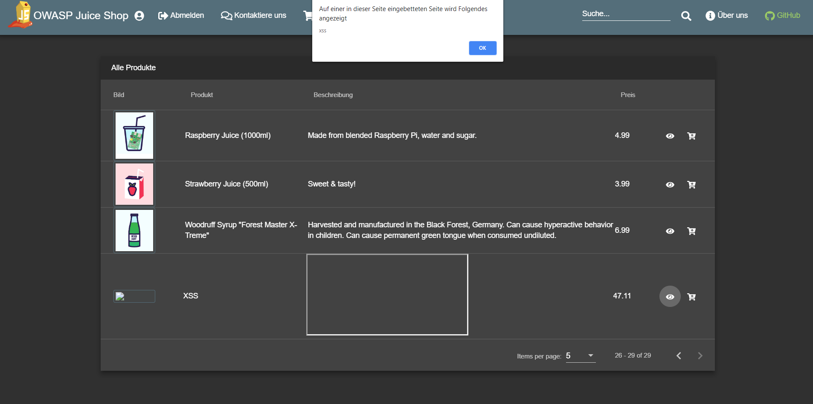
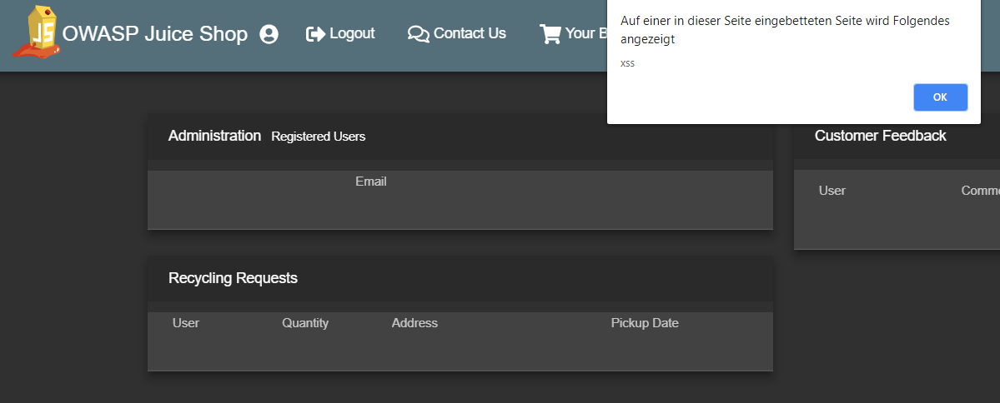

# Appendix - Challenge solutions

All URLs in the challenge solutions assume you are running the
application locally and on the default port http://localhost:3000.
Change the URL accordingly if you use a different root URL.

Often there are multiple ways to solve a challenge. In most cases just
one possible solution is presented here. This is typically the easiest
or most obvious one from the authors perspective.

### Find the carefully hidden 'Score Board' page

1. Open the _Source code view_ of your brower from any screen of the
   Juice Shop application.
2. Scroll down to the end of the `<nav>` tag that defines the menu bar
   (see code snippet below).
3. Notice the commented out `<li>` entry labeled "Score Board".
4. Navigate to http://localhost:3000/#/score-board to solve the
   challenge.

```html
      <li class="dropdown" ng-show="isLoggedIn()">
          <a href="#/complain"><i class="fa fa-bomb fa-lg"></i> <span translate="NAV_COMPLAIN"></span></a>
      </li>
      <!--
      <li class="dropdown">
          <a href="#/score-board">Score Board</a>
      </li>
      -->
      <li class="dropdown ribbon-spacer">
          <a href="#/about"><i class="fa fa-info-circle fa-lg"></i> <span translate="TITLE_ABOUT"></span></a>
      </li>
    </ul>
  </div>
</nav>
```

### Provoke an error that is not very gracefully handled.

Any request that cannot be properly handled by the server will
eventually be passed to a global error handling component that sends an
error page to the client that includes a stacktrace and other sensitive
information. The restful API behaves in a similar way, passing back a
JSON error object with sensitive data, such as SQL query strings.

Here are four examples (out of many different ways) to provoke such an
error situation and solve this challenge along the way:

* Visit <http://localhost:3000/#/search?q=';>


* Visit <http://localhost:3000/ftp/crash>


* Visit <http://localhost:3000/ftp/crash.md>


* Log in to the application with `'` (single-quote) as _Email_ and
  anything as _Password_


### XSS Tier 1: Perform a reflected XSS attack

1. Paste the attack string `<script>alert("XSS1")</script>` into the
   _Search..._ field.
2. Click the _Search_ button.
3. An alert box with the text "XSS1" should appear.


### Get rid of all 5-star customer feedback

1. Log in to the application with any user.
2. Solve
   [Access the administration section of the store](#access-the-administration-section-of-the-store)
3. Delete all entries with five star rating from the _Customer Feedback_
   table using the trashcan button


### Access a confidential document

1. Follow the link to titled _Check out our boring terms of use if you
   are interested in such lame stuff_
   (<http://localhost:3000/ftp/legal.md?md_debug=true>) on the _About
   Us_ page.
2. Successfully attempt to browse the directory by changing the URL into
   <http://localhost:3000/ftp>-
3. Open <http://localhost:3000/ftp/acquisitions.md> to solve the
   challenge.


### Access the administration section of the store

1. Open the `juice-shop.min.js` in your brower's developer tools and
   search for "admin".
2. Among the first entries you will find a route mapping to
   `/administration`.
3. Navigate to http://localhost:3000/#/administration to solve the
   challenge.



### Give a devastating zero-star feedback to the store

1. Visit the _Contact Us_ form and put in a _Comment_ text.
2. The _Submit_ button is **disabled** because you did not select a
   _Rating_.
3. Select any of the stars to set a _Rating_.
4. The _Submit_ button is now **enabled**.
5. Select the same star again to unset the _Rating_.
6. Click the (still **enabled**) _Submit_ button to solve the challenge.
7. You can verify the feedback was saved by checking the _Customer
   Feedback_ widget on the _About Us_ page.


### XSS Tier 2: Perform a persisted XSS attack bypassing a client-side security mechanism


1. Submit a POST request to http://localhost:3000/api/Users with
    * `{"email": "<script>alert(\"XSS2\")</script>", "password": "xss"}`
      as body
    * and `application/json` as `Content-Type` header.
2. Log in to the application with any user.
3. Visit http://localhost:3000/#/administration.
4. An alert box with the text "XSS2" should appear.
5. Close this box. Notice the seemingly empty row in the _Registered
   Users_ table?
6. Click the "eye"-button next to that empty row.
7. A modal overlay dialog with the user details opens where the attack
   string is rendered as harmless text.




### XSS Tier 3: Perform a persisted XSS attack without using the frontend application at all


1. Log in to the application with any user.
2. Copy your `Authorization` header from any HTTP request submitted via
   browser.
3. Submit a POST request to http://localhost:3000/api/Products with
    * `{"name": "XSS3", "description":
      "<script>alert(\"XSS3\")</script>", "price": 47.11}` as body,
    * `application/json` as `Content-Type`
    * and `Bearer ?` as `Authorization` header, replacing the `?` with
      the token you copied from the browser.
4. Visit http://localhost:3000/#/search.
5. An alert box with the text "XSS3" should appear.
6. Close this box. Notice the product row which seemingly lacks a
   description in the _All Products_ table?
7. Click the "eye"-button next to that row.
8. Another alert box with the text "XSS3" should appear.




### XSS Tier 4: Perform a persisted XSS attack bypassing a server-side security mechanism

In the `package.json.bak` you might have noticed the pinned dependency
`"sanitize-html": "1.4.2"`. Internet research will yield a reported
[XSS - Sanitization not applied recursively](https://nodesecurity.io/advisories/135)
vulnerability, which was fixed with version 1.4.3 - one release later
than used by the Juice Shop. The referenced
[GitHub issue](https://github.com/punkave/sanitize-html/issues/29)
explains the problem and gives an exploit example:

> Sanitization is not applied recursively, leading to a vulnerability to
> certain masking attacks. Example:
>
> `I am not harmless: <img src="csrf-attack"/>`
> is sanitized to `I am not harmless: `
>
> Mitigation: Run sanitization recursively until the input html matches
> the output html.

1. Visit http://localhost:3000/#/contact.
2. Enter `<<script>Foo</script>script>alert("XSS4")<</script>/script>`
   as _Comment_
3. Choose a rating and click _Submit_
4. Visit http://localhost:3000/#/about for a first "XSS4" alert (from
   the _Customer Feedback_ slideshow)
5. Visit http://localhost:3000/#/administration for a second "XSS4"
   alert (from the _Customer Feedback_ table)



