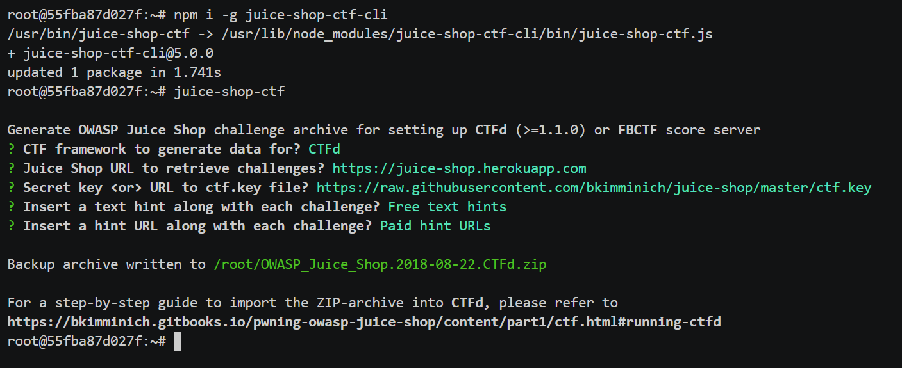
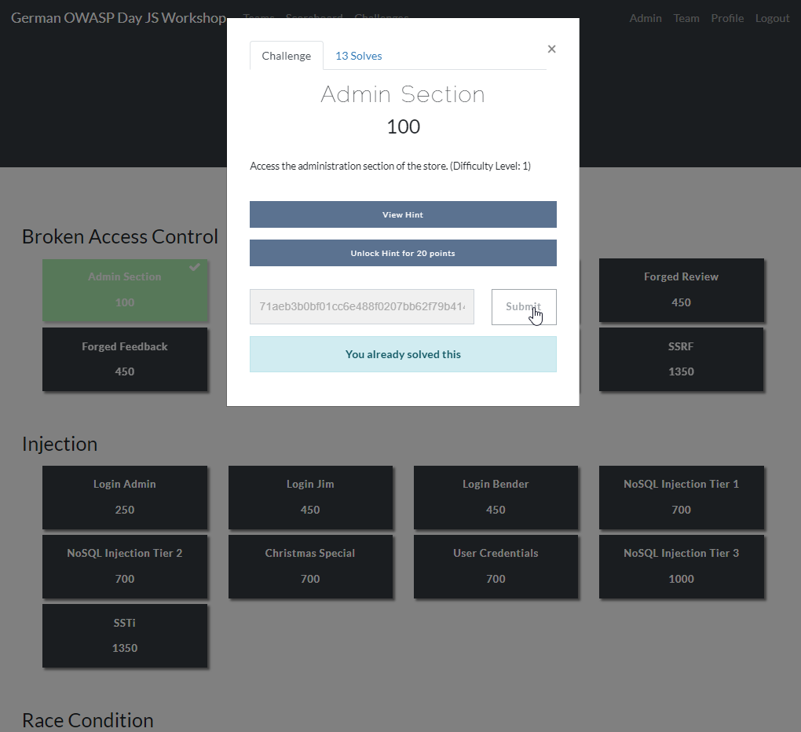

# Hosting a CTF event

> In computer security, Capture the Flag (CTF) is a computer security
> competition. CTF contests are usually designed to serve as an
> educational exercise to give participants experience in securing a
> machine, as well as conducting and reacting to the sort of attacks
> found in the real world. Reverse-engineering, network sniffing,
> protocol analysis, system administration, programming, and
> cryptanalysis are all skills which have been required by prior CTF
> contests at DEF CON. There are two main styles of capture the flag
> competitions: attack/defense and jeopardy.
>
> In an attack/defense style competition, each team is given a machine
> (or a small network) to defend on an isolated network. Teams are
> scored on both their success in defending their assigned machine and
> on their success in attacking the other team's machines. Depending on
> the nature of the particular CTF game, teams may either be attempting
> to take an opponent's flag from their machine or teams may be
> attempting to plant their own flag on their opponent's machine. Two of
> the more prominent attack/defense CTF's are held every year at DEF
> CON, the largest hacker conference, and the NYU-CSAW (Cyber Security
> Awareness Week), the largest student cyber-security contest.
>
> Jeopardy-style competitions usually involve multiple categories of
> problems, each of which contains a variety of questions of different
> point values and difficulties. Teams attempt to earn the most points
> in the competition's time frame (for example 24 hours), but do not
> directly attack each other. Rather than a race, this style of game
> play encourages taking time to approach challenges and prioritizes
> quantity of correct submissions over the timing.[^1]


OWASP Juice Shop can be run in a special configuration that allows to
use it in Capture-the-flag (CTF) events. This can add some extra
motivation and fun competition for the participants of a security
training or workshop.

## Running Juice Shop in CTF-mode

Juice Shop supports _Jeopardy-style CTFs_ by generating a unique _CTF
flag code_ for each solved challenge. These codes are not displayed by
default, but can be made visible by running the application with the
`config/ctf.yml` configuration:

```
set NODE_ENV=ctf     # on Windows
export NODE_ENV=ctf  # on Linux

npm start
```

On Linux you can also pass the `NODE_ENV` in directly in a single
command

```
NODE_ENV=ctf npm start
```

When running the application as a Docker container instead execute

```
docker run -d -p 3000:3000 -e "NODE_ENV=ctf"
```


### Overriding the `ctf.key`

Juice Shop uses the content of the provided `ctf.key` file as the secret
component of the generated CTF flag codes. If you want to make sure that
your flag codes are not the same for every hosted CTF event, you need to
override that secret key.

The simplest way to do so, is by providing an alternative secret key via
the `CTF_KEY` environment variable:

```
set CTF_KEY=xxxxxxxxxxxxxxxxxxxxxxxxxxxxxx     # on Windows
export CTF_KEY=xxxxxxxxxxxxxxxxxxxxxxxxxxxxxx  # on Linux
```

or when using Docker

```
docker run -d -p 3000:3000 -e "NODE_ENV=ctf" -e "CTF_KEY=xxxxxxxxxxxxxxxxxxxxxxxxxxxxxx"
```

## CTF event infrastructure

The pivotal point of any Jeopardy-style CTF event is a central
score-tracking server. It manages the status of the CTF, typically
including

* registration dialogs for teams and users
* leaderboard of users/teams participating in the event
* challenge board with the open/solved hacking tasks and their score
  value
* which challenges have been solved already and by whom

Apart from the server each participant should have their own instance of
OWASP Juice Shop. Having a shared instance for each team is strongly
disrecommended, because Juice Shop is programmed as a single-user
application. It is absolutely important that all Juice Shop instances
participating in a CTF use the same [secret key to generate their CTF
flag codes](#overriding-the-ctfkey). The score server must be set up
accordingly to accept exactly those flag codes for solving the hacking
challenges and allocating their score to the first team/user that solved
it.

As long as the flag code key is identical for all of them, it does not
matter which run option for the Juice Shop each participant uses: Local
Node.js, Docker container or Heroku/Amazon EC2 instances all work fine
as they are independently running anyway! There is no runtime dependency
to the score server either, as participants simply enter the flag code
they see upon solving a challenge manually somewhere on the score
server's user interface.

## Setting up CTFd for Juice Shop

Juice Shop comes with
[the convenient `juice-shop-ctf-cli` tool](https://github.com/bkimminich/juice-shop-ctf)
to to simplify the hosting of CTFs using the open source
[CTFd](https://ctfd.io) framework. This can significantly speed up your
setup time for an event, because things like using the same secret key
for the flag codes are taken care of mostly automatic.

CTFd is a very well-written and stable piece of Open Source Software,
which is why OWASP Juice Shop recommends it as its preferred CTF score
server!


This setup guide assumes that you use CTFd {{book.ctfdVersion}} or
higher.

### Generating CTFd challenges with `juice-shop-ctf-cli`

The
[`juice-shop-ctf-cli`](https://www.npmjs.com/package/juice-shop-ctf-cli)
is a simple command line tool, which will generate a list of SQL
`INSERT` statements. These can be applied to the database underneath
CTFd to generate mirror images of all current Juice Shop challenges in a
CTFd score server. The following instructions were written for
{{book.juiceShopCtfVersion}} of `juice-shop-ctf-cli`.

To install `juice-shop-ctf-cli` you need to have Node.js 4.x or higher
installed. Simply execute

```
npm install -g juice-shop-ctf-cli
```

and then run the tool with

```
juice-shop-ctf
```

The tool will now ask a series of questions. All questions have default
answers available which you can choose by simply hitting `ENTER`.

[](https://asciinema.org/a/120833)

1. **Juice Shop URL to retrieve challenges?** URL of a _running_ Juice
   Shop server where the tool will retrieve the existing challenges from
   via the `/api/Challenges` API. Defaults to
   `https://juice-shop.herokuapp.com` which always hosts the latest
   official released version of OWASP Juice Shop.
2. **Secret key <or> URL to ctf.key file?** Either a secret key to use
   for the CTF flag codes _or_ a URL to a file containing such a key.
   Defaults to
   `https://raw.githubusercontent.com/bkimminich/juice-shop/master/ctf.key`
   which is the key file provided with the latest official OWASP Juice
   Shop release. See [Overriding the `ctf.key`](#overriding-the-ctfkey)
   for more information.
3. **DELETE all CTFd Challenges before INSERT statements?** Determines
   if existing challenges from the CTFd database should be deleted
   before the `INSERT` statements. Defaults to `Yes`.
4. **INSERT a text hint along with each CTFd Challenge?** Offers a
   selectable choice between
   * `No text hints` will not add any hint texts to the CTFd database.
     This is the default choice.
   * `Free text hints` will add the `Challenge.hint` property from the
     Juice Shop database as hint to the corresponding challenge on the
     CTFd server. Viewing this hint is free.
   * `Paid text hints` adds a hint per challenge like described above.
     Viewing this hint costs the team 10% of that challenge's score
     value.
5. **INSERT a hint URL along with each CTFd Challenge?** Offers a
   selectable choice between
   * `No hint URLs` will not add any hint URLs to the CTFd database.
     This is the default choice.
   * `Free hint URLs` will add the `Challenge.hintUrl` property from the
     Juice Shop database as a hint to the corresponding challenge on the
     CTFd server. Viewing this hint is free.
   * `Paid hint URLs` adds a hint per challenge like described above.
     Viewing this hint costs the team 20% of that challenge's score
     value.
6. **SELECT all CTFd Challenges after INSERT statements?** Determines if
   the created challenges should be retrieved after the `INSERT`
   statements. Defaults to `Yes`.

The category of each challenge is identical to its category in the Juice
Shop database. The score value of each challenge is calculated by the
`juice-shop-ctf-cli` program:

* 1-star challenge = 100 points
* 2-star challenge = 250 points
* 3-star challenge = 450 points
* 4-star challenge = 700 points
* 5-star challenge = 1000 points

The entire output of the tool will finally be written into
`insert-ctfd-challenges.sql` in the folder the program was started in.



### Running CTFd

To apply the generated `insert-ctfd-challenges.sql`, follow the steps
describing your preferred CTFd run-mode below.

#### Default setup (including SQLite database)

1. Get CTFd with `git clone https://github.com/CTFd/CTFd.git`.
2. Perform steps 1 and 3 from
   [the CTFd installation instructions](https://github.com/CTFd/CTFd#install).
3. Use your favourite SQLite client to connect to the CTFd database and
   execute the `INSERT` statements you created.
4. Browse to your CTFd instance UI (by default <http://127.0.0.1:4000>)
   and create an admin user and CTF name

#### `docker-compose` setup (including MySQL container)

1. Setup
   [Docker host and Docker compose](https://docs.docker.com/compose/install/).
2. Follow steps 2-4 from
   [the CTFd Docker setup](https://github.com/isislab/CTFd/wiki/Deployment#docker)
   to download the source code, create containers and start them.
3. After running `docker-compose up` from previous step, you should be
   able to browse to your CTFd instance UI (`<<docker host IP>>:8000` by
   default) and create an admin user and CTF name.
4. Once you have done this, run `docker-compose down` or use `Ctrl-C` to
   shut down CTFd. Note: Unlike a usual Docker container, data will
   persist even afterwards.
5. Add the following section to the `docker-compose.yml` file and then
   run `docker-compose up` again:

   ```
   ports:
     - "3306:3306"
   ```

6. Use your favourite MySQL client to connect to the CTFd database
   (default credentials are root with no password) and execute the
   `INSERT` statements you created.
7. Browse back to your CTFd instance UI and check everything has worked
   correctly.
8. If everything has worked, do another `docker-compose down`, remove
   the ports section you added to `docker-compose.yml` and then do
   `docker-compose up` again and you are ready to go!

Once you have CTFd up and running, you should see all the created data
in the _Challenges_ tab:




## Using other CTF frameworks

:wrench:[**TODO**](https://github.com/bkimminich/pwning-juice-shop/issues/5)

## Commercial use disclaimer

:warning: Bear in mind: With the increasing number of challenge
solutions (this book included) available on the Internet _it might
**not** be wise to host a professional CTF for prize money_ with OWASP
Juice Shop!

[^1]: https://en.wikipedia.org/wiki/Capture_the_flag#Computer_security

