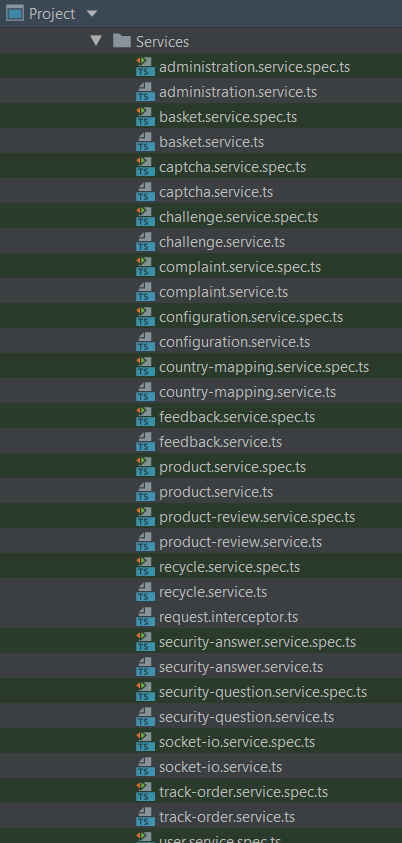

# Codebase 101

Jumping head first into any foreign codebase can cause a little
headache. This section is there to help you find your way through the
code of OWASP Juice Shop. On its top level the Juice Shop codebase is
mainly separated into a client and a server tier, the latter with an
underlying lightweight database and file system as storage.

## Client Tier

OWASP Juice Shop uses v1.5 of the popular
[AngularJS](https://angularjs.org/) framework as the core of its
client-side. Thanks to the [Bootstrap](http://getbootstrap.com/) CSS
framework, the UI is responsive letting it adapt nicely to different
screen sizes. Both frameworks work very well together thanks to the
[UI Bootstrap](https://angular-ui.github.io/bootstrap/) library that
provides components for Bootstrap that are explicitly written for
AngularJS. The various icons used throughout the frontend are from the
vast [Font Awesome 5](https://fontawesome.com/) collection.


### Services

The client-side AngularJS services reside in the `app/js/services`
folder. Each service file handles all RESTful HTTP calls to the Node.js
backend for a specific domain entity or functional aspect of the
application.



Service functions must **always** use `$q.defer()` to wrap the return
value of the `$http` backend call into a `promise`. If the backend call
was successful, the promise will be resolved. In case of an error, the
promise will be rejected.

The following code snippet shows how all services in the OWASP Juice
Shop client are structured using the example of `FeedbackService`. It
wraps the `/api/Feedback` API which offers a `GET`, `POST` and `DELETE`
endpoint to find, create and delete `Feedback` of users:

```javascript
angular.module('juiceShop').factory('FeedbackService', ['$http', '$q', function ($http, $q) {
  'use strict'

  var host = '/api/Feedbacks'

  function find (params) {
    var feedbacks = $q.defer()
    $http.get(host + '/', {params: params}).success(function (data) {
      feedbacks.resolve(data.data)
    }).error(function (err) {
      feedbacks.reject(err)
    })
    return feedbacks.promise
  }

  function save (params) {
    var createdFeedback = $q.defer()
    $http.post(host + '/', params).success(function (data) {
      createdFeedback.resolve(data.data)
    }).error(function (err) {
      createdFeedback.reject(err)
    })
    return createdFeedback.promise
  }

  function del (id) {
    var deletedFeedback = $q.defer()
    $http.delete(host + '/' + id).success(function (data) {
      deletedFeedback.resolve(data.data)
    }).error(function (err) {
      deletedFeedback.reject(err)
    })
    return deletedFeedback.promise
  }

  return {
    find: find,
    save: save,
    del: del
  }
}])
```

:rotating_light: Unit tests for all services can be found in the `test/client/services`
folder. They are [Jasmine 2](https://jasmine.github.io) specifications
which are executed by the [Karma](https://karma-runner.github.io) test
runner.

### Controllers

:wrench: **TODO**

:rotating_light: Unit tests for all controllers can be found in the
`test/client/controllers` folder. Like the
[service unit tests](#services) they are written in
[Jasmine 2](https://jasmine.github.io) and run on
[Karma](https://karma-runner.github.io).

### Views

:wrench: **TODO**

### Index page template

:wrench: **TODO**

### Client-side code minification

All client side code (except the `index.html`) is first _uglified_ (for
[security by obscurity](https://en.wikipedia.org/wiki/Security_through_obscurity))
and then _minified_ (for initial load time reduction) during the build
process (launched with `npm install`) of the application. This creates
an `app/dist/juice-shop.min.js` file, which is included by the
`index.html` to load all application-specific client-side code.

If you want to quickly test client-side code changes, it can be
cumbersome to launch `npm install` over and over again. Instead you can
simply trigger the minification to generate the `juice-shop.min.js` file
with

```
grunt minify
```

and then refresh your browser with `F5` to test your changes. This will
require grunt being installed globally on your system, so if above
command fails for you, please run `npm install -g grunt-cli` once to
install this useful task runner. From then on, `grunt minify` should
work.

## Server Tier

:wrench: **TODO**


### Routes

:wrench: **TODO**

:rotating_light: Unit tests for all routes can be found in the `test/server` folder.
These tests are written using the [Chai](http://chaijs.com/) assertion
library in conjunction with the [Mocha](https://mochajs.org/) test
framework.

#### Generated API endpoints

:rotating_light: Integration tests for all API endpoints can be found in the `test/api`
folder. These tests are specified using
[Frisby.js](https://www.frisbyjs.com/) and are executed by Facebook's
[Jest](https://facebook.github.io/jest/).

:wrench: **TODO**

#### Hand-written routes

:wrench: **TODO**

:rotating_light: Integration tests for hand-written routes can be found in the `test/api`
folder alongside all other API endpoint tests, from where
[Frisby.js](https://www.frisbyjs.com/)/[Jest](https://facebook.github.io/jest/)
assert the functionality of the entire backend on HTTP-request/response
level.

### Custom libraries

:wrench: **TODO**

#### Useful utilities

:wrench: **TODO**

#### Insecurity features

:wrench: **TODO**

## Storage Tier

:wrench: **TODO**


### Database

:wrench: **TODO**

#### Populating the DB

:wrench: **TODO**

### Non-relational database

:wrench: **TODO**

### File system

:wrench: **TODO**

## End-to-end tests

:wrench: **TODO**
